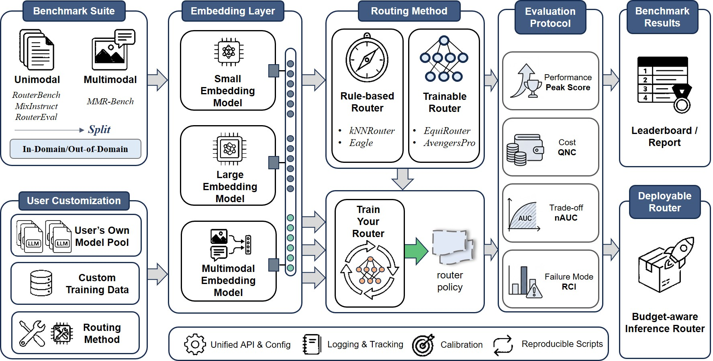

<p align="center">
  
</p>

<p align="center">
  <a href="#introduction">Introduction</a> ·
  <a href="#orbit-and-routejudge">RouteJudge</a> ·
  <a href="#quick-start">Quick Start</a> ·
  <a href="#methods-reproduced">Methods</a> ·
  <a href="#evaluation-metrics">Metrics</a> ·
  <a href="#benchmark-suite">Benchmarks</a> ·
  <a href="#extending-orbit">Extending</a> ·
  <a href="#contribution-guidelines">Contributing</a> ·
  <a href="#citing-orbit-and-routejudge">Citation</a> ·
  <a href="#contact">Contact</a>
</p>

## Introduction

**ORBIT (Optimal Routing and Budgeted Inference Toolbox)** is a modular, extensible toolbox for **LLM routing**. It studies how to select the most suitable model from a heterogeneous model pool **for each query**, under practical deployment constraints such as **cost, latency, and throughput**.

<p align="center">
  
</p>

LLM routing methods are rapidly emerging, but existing implementations are often fragmented: they use different benchmark splits, cost assumptions, evaluation scripts, and router interfaces. This makes fair comparison and reproducibility difficult.

ORBIT standardizes the end-to-end routing workflow into a unified research stack:

- **Unified pipeline and router interface**: dataset loading -> embedding extraction -> router training/inference -> standardized evaluation, all driven by consistent JSON configs.
- **Budget-aware evaluation**: sweep budgets to trace performance-cost trade-offs and report curve-level metrics such as **nAUC**, **Peak Score**, **QNC**, and **RCI**.
- **Extensible benchmark and method suite**: built-in support for unimodal and multimodal routing benchmarks, reproduced routing methods, and clean interfaces for adding datasets, embedding encoders, and routers.

ORBIT currently supports large-scale routing evaluation with up to **8.65M** benchmark instances and is designed to accelerate reproducible research on budget-aware LLM routing systems.

---

## ORBIT and RouteJudge

ORBIT is the standardized development and integration layer for **RouteJudge**, an open platform for reproducible and preference-aware LLM routing evaluation.

While ORBIT focuses on offline router development, benchmarking, and reproducible protocol design, RouteJudge extends routing evaluation to **online user preference feedback**. In RouteJudge, multiple routers recommend models under the same model pool and budget constraints; selected responses are shown to users through anonymous pairwise comparison; and user preferences are attributed back to the routers behind the compared responses.

Researchers can use ORBIT to implement and validate new routers, then submit compatible methods for RouteJudge historical replay and online preference-based evaluation.

We welcome contributions from the community:

- Submit a pull request to add a new router, benchmark, embedding encoder, or evaluation utility.
- Open an issue if you would like feedback before implementing a larger method.
- Email us if you would like to integrate your routing method into ORBIT and RouteJudge evaluation.

Useful links:

- RouteJudge platform: [https://routejudge.cn](https://routejudge.cn)
- RouteJudge paper: [arXiv:2606.18774](https://arxiv.org/abs/2606.18774)
- ORBIT repository: [https://github.com/AIGNLAI/LAMDA-ORBIT](https://github.com/AIGNLAI/LAMDA-ORBIT)

---

## What's New

- **2026-06**: Initial release of ORBIT v1.0 with a unified routing pipeline, standardized budget-aware evaluation, unimodal and multimodal benchmarks, and reproduced routing methods.

---

## Methods Reproduced

ORBIT reproduces **22 representative LLM routing methods** across training-free, retrieval-based, and learned routers under a unified pipeline and standardized budgeted evaluation.

- **Avengers**: A training-free recipe that clusters queries and routes by cluster-wise capability profiles with sampling/voting. [[Paper]](https://arxiv.org/abs/2505.19797)
- **Avengers-Pro**: A test-time routing framework that traces a Pareto frontier via clustering and a tunable performance-efficiency objective. [[Paper]](https://arxiv.org/abs/2508.12631)
- **EmbedLLM**: Learns compact vector representations of LLMs to enable efficient performance prediction and scalable routing over many candidates. [[Paper]](https://arxiv.org/abs/2410.02223)
- **Eagle**: A training-free router that maintains global/local Elo-style rankings to select models efficiently. [[Paper]](https://arxiv.org/abs/2409.15518)
- **EquiRouter**: A decision-aware learning-to-rank router that directly supervises instance-wise model rankings to improve accuracy-cost trade-offs. [[Paper]](https://arxiv.org/abs/2602.03478)
- **GraphRouter**: Builds a heterogeneous task-query-LLM graph and casts routing as inductive edge prediction with GNNs for better generalization. [[Paper]](https://arxiv.org/abs/2410.03834)
- **HybridLLM**: Predicts query difficulty and routes between a small and a large model under a tunable desired-quality target. [[Paper]](https://arxiv.org/abs/2404.14618)
- **kNN**: A nonparametric baseline that selects models via nearest neighbors in embedding space using historical per-model outcomes. [[Paper]](https://arxiv.org/abs/2408.12320)
- **MLPRouter**: A parametric embedding-to-decision MLP baseline for budgeted routing. [[Paper]](https://arxiv.org/abs/2408.12320)
- **SVMRouter**: A linear classifier baseline that routes from query features/embeddings to model decisions. [[Paper]](https://arxiv.org/abs/2408.12320)
- **MIRT**: An IRT-based router using multidimensional item response theory to jointly estimate model abilities and query attributes. [[Paper]](https://aclanthology.org/2025.acl-long.761/)
- **NIRT**: A neural IRT variant that replaces hand-designed interactions with a neural function for richer ability-difficulty modeling. [[Paper]](https://aclanthology.org/2025.acl-long.761/)
- **ModelSAT**: Learns routing with explicit model capability representations via a capability encoder and a lightweight LLM. [[Paper]](https://arxiv.org/abs/2502.17282)
- **OmniRouter**: Formulates routing as constrained optimization to minimize total cost while satisfying a target performance constraint. [[Paper]](https://arxiv.org/abs/2502.20576)
- **RM-Classification**: A regret-minimization router trained from observational bandit logs using a classification-style surrogate objective. [[Paper]](https://arxiv.org/abs/2505.16037)
- **RM-Interval**: An interval-conditioned regret-minimization router designed to generalize across unseen budget levels by conditioning on cost preferences. [[Paper]](https://arxiv.org/abs/2505.16037)
- **RM-Softmax**: An end-to-end regret-minimization router optimizing a softmax-weighted regret surrogate. [[Paper]](https://arxiv.org/abs/2505.16037)
- **RouteLLM-BERT**: A BERT-based classifier trained on pairwise preference data for routing. [[Paper]](https://arxiv.org/abs/2406.18665)
- **RouteLLM-MF**: Learns low-rank query-model interactions via matrix factorization over preference outcomes for efficient scoring. [[Paper]](https://arxiv.org/abs/2406.18665)
- **RouteLLM-SWRanking**: A similarity-weighted ranking approach that upweights comparisons from prompts similar to the current query. [[Paper]](https://arxiv.org/abs/2406.18665)
- **RouterDC**: Learns query and model embeddings via dual contrastive objectives to better model query-model compatibility. [[Paper]](https://arxiv.org/abs/2409.19886)
- **Oracle**: A non-deployable upper bound that selects the best feasible model per query using ground-truth outcomes.

---

## Evaluation Metrics

ORBIT evaluates LLM routing under **budgeted inference** by sweeping budgets to obtain a **performance-cost trade-off curve**. It reports standardized metrics for fair comparison and diagnostic analysis.

### Trade-off metrics

- **nAUC (normalized Area Under Curve)**: summarizes the overall performance-cost trade-off across budgets. Higher is better.
- **Peak Score**: reports the best achievable utility within the evaluated budget range. Higher is better.
- **QNC (Quality Neutral Cost)**: measures cost-efficiency under quality-neutral comparison. Lower is better.

### Diagnostic metrics

- **RCI (Routing Collapse Index)**: diagnoses collapse and other failure modes beyond average utility.

---

## Quick Start

### Clone and setup

```bash
git clone https://github.com/AIGNLAI/LAMDA-ORBIT
cd LAMDA-ORBIT
```

Create a virtual environment and install dependencies:

```bash
python -m venv .venv
source .venv/bin/activate  # Linux / macOS

pip install -U pip
pip install -r requirement.txt
```

> Note: The commands above are tested on Linux. Windows users may need to resolve library compatibility issues such as `setuptools`, `triton`, or `vllm` according to their local environment.

### Download embedding models

ORBIT supports plugging in any HuggingFace embedding model. We recommend downloading required checkpoints in advance.

```bash
conda install -c conda-forge aria2
curl -L https://hf-mirror.com/hfd/hfd.sh -o hfd.sh
chmod +x hfd.sh
./hfd.sh <HF_MODEL_ID>
```

### Configuration

ORBIT is driven by two JSON configs: one for the benchmark setting and one for the routing algorithm.

- **Dataset-level config** (`configs/benchmarks/[DATASET].json`): defines modality, data protocol, train/test split, query representation, encoder settings, random seeds, logging, and output paths.
- **Method-level config** (`configs/routers/[METHOD].json`): defines router hyperparameters, training setup, and method-specific options.

### Run an experiment

```bash
python main.py --dataset <dataset_name> --method <method_name>
```

Examples:

```bash
python main.py --dataset Routerbench --method AvengersPro
python main.py --dataset MMRBench --method EquiRouter
python main.py --dataset Mixinstruct --method Oracle
```

---

## Benchmark Suite

ORBIT includes a compact benchmark suite spanning text-only and multimodal routing settings, with model pools ranging from small curated sets to large-scale collections.

| Benchmark       | Modality   | #Models | Notes                                                        |
| --------------- | ---------- | ------: | ------------------------------------------------------------ |
| **RouterBench** | Text       |      11 | Small text-only pool for controlled budgeted routing evaluation. |
| **RouterEval**  | Text       |     289 | Large text-only pool for scalability and robustness analysis. |
| **MMR-Bench**   | Multimodal |       9 | Multimodal routing with visual inputs.                       |
| **MixInstruct** | Text       |      12 | Text-only instruction-style queries across mixed sources.    |

> Note: RouterEval provides 12 dataset files with nested model pools. To ensure a consistent evaluation protocol, ORBIT extracts 289 common models from Group A's six files and aligns their performance records on the largest shared query set across tasks.

---

## Extending ORBIT

ORBIT is designed for community extension. You can add new benchmarks, embedding encoders, and routing algorithms while reusing the same data loading, embedding, evaluation, and logging pipeline.

### 1. Adding a new dataset

1. **Generate the dataset in ORBIT format** using the `data_generator` workflow. Specify the model pool, upload your data, and generate the corresponding dataset files.
2. **Register the dataset** in `utils/data.py` and implement the required dataset base class so that it can be loaded by ORBIT's unified pipeline.
3. **Create benchmark configs** under `configs/benchmarks/` to define modality, split protocol, encoder settings, and dataset-level options.
4. **Provide model descriptions** under `configs/description/` if your target methods require them, such as GraphRouter or MIRT.

### 2. Adding a new embedding encoder

1. Register the embedding model in `utils/embedding.py`.
2. Select it in the corresponding benchmark config under `configs/benchmarks/`.

### 3. Adding a new routing algorithm

1. Create a router class under `methods/`. ORBIT provides a `BaseRouter` that already implements dataset loading, embedding extraction, and standardized evaluation.
2. Inherit from `BaseRouter` and implement your own training and prediction functions.
3. Register the new router in `methods/__init__.py` and `train.py`.
4. Add a JSON config under `configs/routers/` for method hyperparameters.
5. Run offline evaluation and include clear reproduction instructions in your pull request.

If you are unsure how to adapt your method to the ORBIT interface, please open an issue or email us. We are happy to discuss integration and RouteJudge evaluation for new routing methods.

---

## Contribution Guidelines

We welcome pull requests that improve ORBIT's method coverage, benchmark support, documentation, and evaluation utilities.

Before submitting a PR, please try to include:

- A concise description of the method, dataset, or utility being added.
- Configuration files needed to reproduce the experiment.
- Required dependencies or checkpoint instructions.
- Random seeds and preprocessing details when applicable.
- A minimal command-line example.

For larger additions, especially new routing methods intended for RouteJudge evaluation, please open an issue or email us first so that we can coordinate the expected interface and evaluation protocol.

---

## Citing ORBIT and RouteJudge

If you use ORBIT or RouteJudge in your research, please cite:

```bibtex
@inproceedings{lai2026routejudge,
  title     = {RouteJudge: Preference-Based Evaluation of {LLM} Routers under Pluralistic User Preferences},
  author    = {Guannan Lai and Haoran Hu and Han-Jia Ye},
  booktitle = {Pluralistic Alignment Workshop at ICML 2026},
  year      = {2026}
}

@misc{lai2026routejudgeopenplatformreproducible,
  title         = {RouteJudge: An Open Platform for Reproducible and Preference-Aware LLM Routing},
  author        = {Guannan Lai and Haoran Hu and Han-Jia Ye},
  year          = {2026},
  eprint        = {2606.18774},
  archivePrefix = {arXiv},
  primaryClass  = {cs.LG},
  url           = {https://arxiv.org/abs/2606.18774}
}
```

---

## Acknowledgments

We thank the authors of the following open-source repositories for their contributions:

- [GraphRouter](https://github.com/ulab-uiuc/GraphRouter)
- [routerbench](https://github.com/withmartian/routerbench)
- [RouterEval](https://github.com/MilkThink-Lab/RouterEval)
- [MMR-Bench](https://github.com/Hunter-Wrynn/MMR-Bench)
- [OmniRouter](https://github.com/dongyuanjushi/OmniRouter)

---

## Contact

For questions, feature requests, or contributions:

- Open an issue on [GitHub](https://github.com/AIGNLAI/LAMDA-ORBIT/issues).
- Email the authors at [laign@lamda.nju.edu.cn](mailto:laign@lamda.nju.edu.cn).

If you would like to add your routing method to ORBIT or have it considered for RouteJudge evaluation, please contact us by issue or email.

---

## Star History

[](https://star-history.com/#AIGNLAI/LAMDA-ORBIT&Date)

